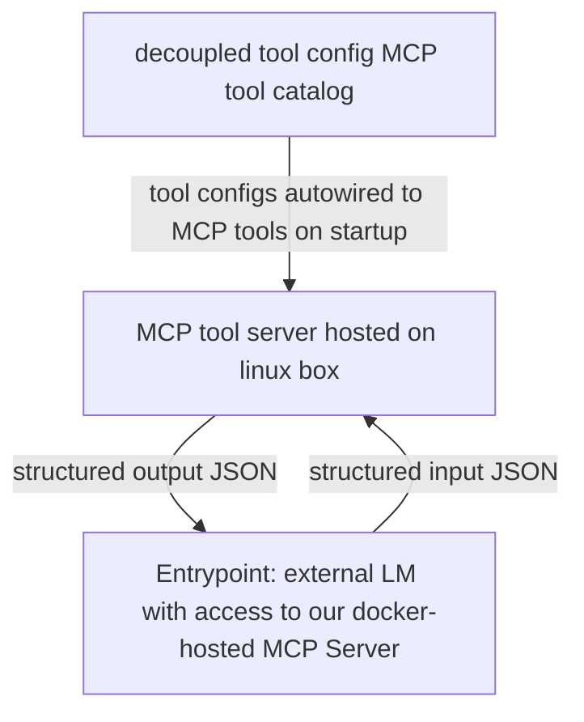

## Purpose
A portable, version-controlled LM toolset built for reliable CLI interaction and easy extension.

## Solution Specification
Agents connect to a locally hosted MCP server that hosts custom tools ranging from access to local CLI commands, to prompt extensions, to python script runners.

## Testing Specification
### Startup
- Fast build: `docker compose up -d`
  Fastest, keep everything running -- If `clai` is already running, tool changes in `src/tools` will not be reloaded.
- Soft refresh: `docker compose up -d --force-recreate flakegen clai`
  Use after tool spec/source changes when you want fresh registration from `src/tools` without wiping `/nix`.
- Hard refresh: `docker compose down --remove-orphans --volumes`, then `docker compose up -d --pull always --force-recreate flakegen clai`
  Use for clean CLI package/toolchain reinstall and re-registration when Nix cache state may be stale or suspect.

### Validation Checks
After startup:
- `http://localhost:${FASTMCP_HOST_PORT:-8000}/mcp` should provide access to our MCP Server's tools. Test connectivity by trying to use any tool.
- logs should show that <src/tools/core/healthcheck/test nested tool calls> was called and displays no functional defects, demonstrating a nested tool call successfully took place.
- logs should show a count of successful and failed tool registrations, as well as a catalog of available tools with names and descriptions.
- If you have access to an LM, have it try and call any number of tools to 1. test the MCP Server's availability and 2. test the function of the tool. 

## Standards
- Spec-Driven Development -- Always use the Solution Specification section to give yourself context of the structure and overall function of the feature scope when working on the project. Use PLANS.md when appropriate as a transient short term memory, like for saving proposals for user approval or keeping a to-do list.
- Test-Driven Development -- validate as you go referencing the Testing Specification section for guidance.
- User Cognitive Ownership -- A human should always intuitively understand and approve a new feature/spec/validation pathway.

## Boundaries
- Don't add new logic, classes, or files without a really good reason to do so or explicit permission -- prefer simplicity and minimalism.
- Never call it a day without validating your working using guidance from the Test Specification section.
