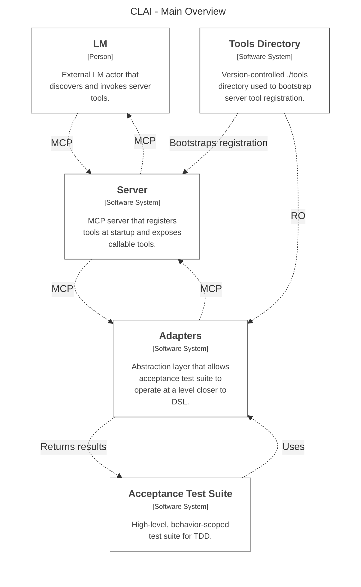

## Purpose
A portable, version-controlled LM toolset built for safe, reliable CLI interaction and easy extension.

## Solution Specification
Agents connect to a locally hosted MCP server that hosts custom tools ranging from access to local CLI commands, to prompt extensions, to python script runners.

Source of truth: `workspace.dsl`

System Overview (auto-generated on build from DSL)
<!-- BEGIN:STRUCTURIZR_MAIN_OVERVIEW -->

<!-- END:STRUCTURIZR_MAIN_OVERVIEW -->

Regenerate diagram from DSL (manual):
- `docker compose up --force-recreate diagramclean diagramgen diagramsync`

Automatic generation on build/startup:
- `docker compose up` now runs `diagramclean`, `diagramgen`, `diagramsync`, `flakegen`, `clai`, and `acceptance` in sequence.
- Generation is idempotent: temporary diagram artifacts are cleaned, generated from `workspace.dsl`, synced into this file, and then removed.

## Testing Specification
### Startup
#### Fast build:
`docker compose up -d`
Fastest, keep everything running -- If `clai` is already running, tool changes in `tools` will not be reloaded.
Also refreshes generated Mermaid diagrams from `workspace.dsl`.
#### Soft refresh:
`docker compose up -d --force-recreate flakegen clai`
Use after tool spec/source changes when you want fresh registration from `tools` without wiping `/nix`.
Also refreshes generated Mermaid diagrams from `workspace.dsl`.
#### Hard refresh:
`docker compose down --remove-orphans --volumes`, then `docker compose up -d --pull always --force-recreate flakegen clai`
Use for clean CLI package/toolchain reinstall and re-registration when Nix cache state may be stale or suspect.
Also refreshes generated Mermaid diagrams from `workspace.dsl`.

### Validation Checks
Build-time validation is automatic:
- `acceptance` runs `python -m unittest discover -s tests -p "acceptance_tests.py" -v`.
- Acceptance executes smoke checks first (diagram sync invariants, MCP `initialize` healthcheck), then tool checks.
- user/LM checks `docker compose` exit codes and logs for pass/fail.

## Standards
- Spec-Driven Development -- Always use the Solution Specification section to give yourself context of the structure and overall function of the feature scope when working on the project. Use PLANS.md when appropriate as a transient short term memory, like for saving proposals for user approval or keeping a to-do list.
- Test-Driven Development -- validate as you go referencing the Testing Specification section for guidance.
- User Cognitive Ownership -- Ensure a human always understands a new feature/spec/validation pathway via explicit approval.

## Boundaries
- Don't add new logic, classes, or files without a really good reason to do so or explicit permission -- prefer simplicity and minimalism.
- Never call it a day without validating your working using guidance from the Test Specification section.
