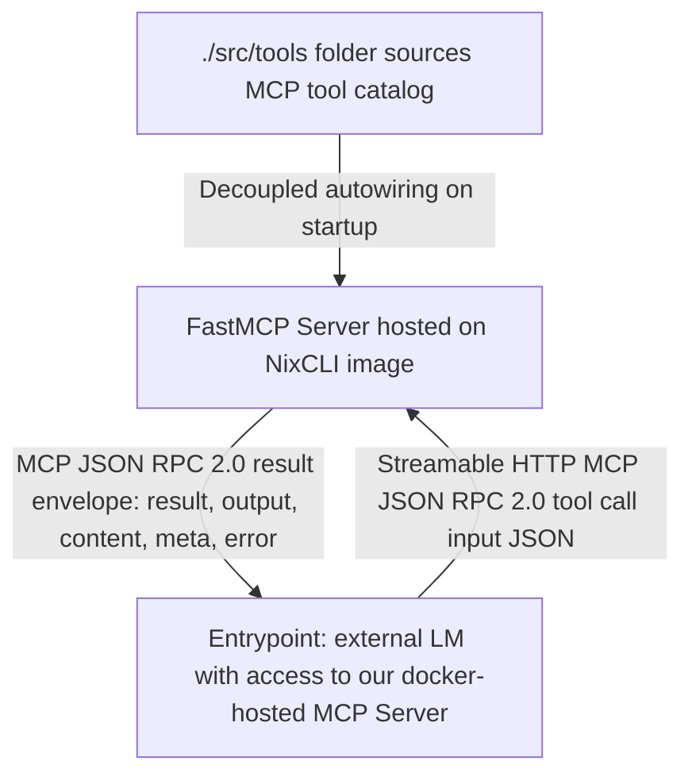

## Purpose
A portable, version-controlled LM toolset built for reliable CLI interaction and easy expansion.

## Solution Specification
Agents connect directly to a FastMCP server on a Nix CLI box that hosts config-first tools ranging from CLI tools to prompt extensions to python scripts.

## Testing Specification
### Startup
Use health-gated startup without manual polling or pre-prune steps.
- `docker compose up --build --pull always`
- For clean tool installation and re-registration: `docker compose down --remove-orphans --volumes`

### Validation Checks
After starting the server, confirm:
- clients can connect directly to FastMCP at `http://localhost:${FASTMCP_HOST_PORT:-8000}/mcp`.
- bootstrap runs from the `clai` startup flow and targets FastMCP via `MCP_SERVER_URL` (default: `http://clai:8000/mcp`).
- `[validation] PASS nested_tool_calls_invoked` appears once in `clai` logs.
  This confirms the healthcheck tool `core.healthcheck.test_nested_tool_calls` was invoked directly through FastMCP.
- one `clai` log line includes `[healthcheck] nested_tool_call_result:` with the returned structured payload.

## Standards
- Spec-Driven Development -- Always use the Solution Specification section to give yourself context of the structure and overall function of the feature scope when working on the project. Use PLANS.md when appropriate as a transient short term memory, like for saving proposals for user approval or keeping a to-do list.
- Test-Driven Development -- validate as you go referencing the Testing Specification section for guidance.
- User Cognitive Ownership -- A human should always intuitively understand and approve a new feature/spec/validation pathway.
- Validate constantly when implementing -- when adding features to this project, or changing existing features, you should always be tethering yourself to real data/outcomes by validating using the appropriate guidance from Testing Specification. 
- CLI tool pre-prompts are defined in `src/server/tool_mounting/tool_mounts/cli.py` and exposed to MCP clients via tool `_meta.tool_pre_prompt`.

## Boundaries
- Don't add significant logic without a really good reason to do so or explicit permission -- prefer simplicity and minimalism.
- Never call it a day without validating your working using guidance from the Test Specification section.
